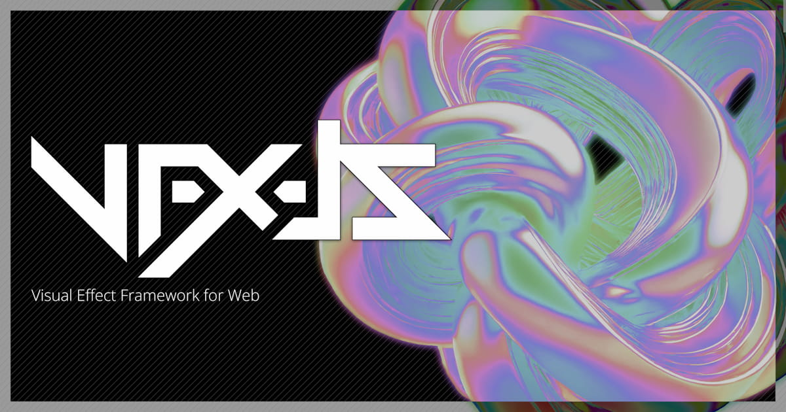

<div align="center">
  <a href="https://amagi.dev/vfx-js/" target="_blank"></a>
  <h1>VFX-JS: Visual Effects Framework for Web</h1>
  <br/>
  <br/>
</div>

VFX-JS is a JavaScript library to add WebGL-powered effects to your website.
You can easily attach it to normal ``, `<video>` elements etc.


See also [`@vfx-js/react`](https://www.npmjs.com/package/@vfx-js/react) for React bindings.


## Usage

Install via npm:

```
npm i @vfx-js/core
```

Then create `VFX` object in your script:

```js
import { VFX } from '@vfx-js/core';

const img = document.querySelector('#img');

const vfx = new VFX();
vfx.add(img, { shader: "glitch", overflow: 100 });
```

Or compose prebuilt effects from [`@vfx-js/effects`](https://www.npmjs.com/package/@vfx-js/effects):

```js
import { VFX } from '@vfx-js/core';
import { BloomEffect, PixelateEffect } from '@vfx-js/effects';

const vfx = new VFX();
vfx.add(img, {
    effect: [new PixelateEffect({ size: 10 }), new BloomEffect({ intensity: 5 })],
});

// Replace the effect chain in-place (keeps the source texture and any
// effect instances whose reference is unchanged):
vfx.updateEffects(img, [new BloomEffect({ intensity: 8 })]);
```

## Examples

TBD: See VFX-JS website for now.

https://amagi.dev/vfx-js/


## Author

[AMAGI](https://twitter.com/amagitakayosi)

## LICENSE

MIT
